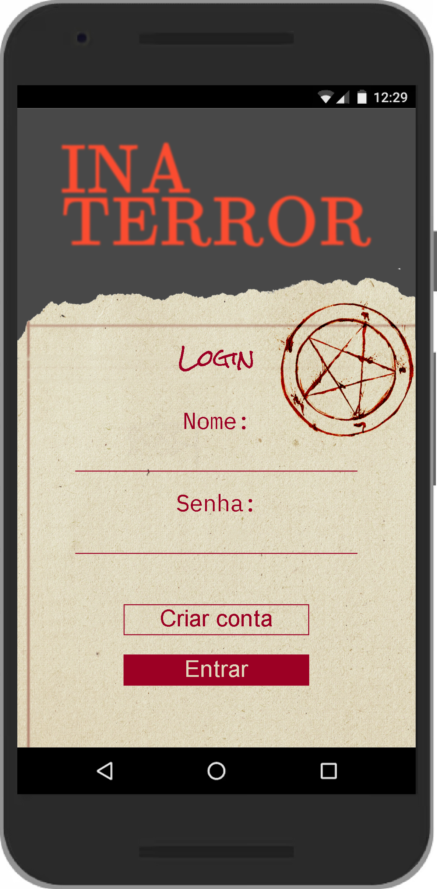
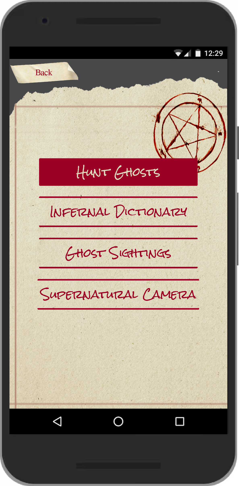
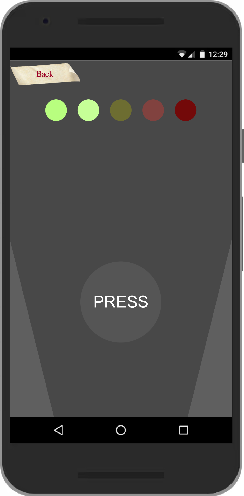
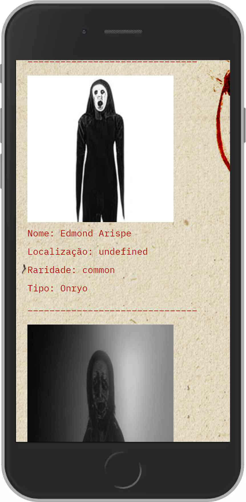

<p style="">


# InaTerror Front-end ReactJS

## Tecnologias :rocket:

- ReactJS
- Python
- mongoDB
- PWA

## Iniciando 🏁 

1. Na linha de comando usar o comando: 
```bash
  git clone url_projeto_inaterror
```

2. Entrar na pasta criada para o projeto clonado com:
```bash
  cd nome_pasta
```

3. Abrir o projeto no VScode ou outra IDE desejada; 

4. Com o **NodeJS lts** instalado(https://nodejs.org/en/) rodar o comando abaixo na linha de comando para instalar as dependências:
```bash
  npm i
```

5. E finalmente para executar o projeto, use:
```bash
 npm start
```

## Interface do usuário 🎨


<p align="center">
   
   
</p>

O aplicativo inaterror é uma ferramenta para detectar a presença de monstros através de um sensor de ondas eletromagnéticas e uma câmera fantasmagórica. O app possui quatro páginas além da página de login, que serão descritas abaixo: 

**1- Hunt Ghosts** : é o sensor que detecta ondas eletromágneticas alteradas. Ao clicar no botão PRESS o software pede permissão para acessar a localização do usuário atual e varia os ‘leds’ de acordo com a mudança de ondas. A um determinado ponto o sensor detecta uma aparição e se está for perigosa sugere ao usuário que corra(‘RUN’).
<p align="center">

</p>		

**2- Infernal Dictionary** : é o dicionário de monstros conhecidos, onde há uma descrição breve de cada aparição e suas forças, fraquezas e as evidências de sua presença.
<p align="center">

</p>

**3- Ghost Sightings** : página que guarda uma foto de cada uma das aparições encontradas na localização do usuário atual, nome, raridade e tipo da aparição.
<p align="center">

</p>

**4- Supernatural Camera** : câmera que será utilizada para caçar os monstros.</p>
<p align="center">
	
	
</p>

## Acesso e utilização 👻
- Para utilizar o aplicativo web é só acessar o link: inaterror2.vercel.app. 
- Para usar o aplicativo móvel basta ir nas configurações da página e clicar em ‘fazer download’.
<p align="center">

</p>

Obs: O aplicativo está disponível para Android e IOS.</p>
</div>
