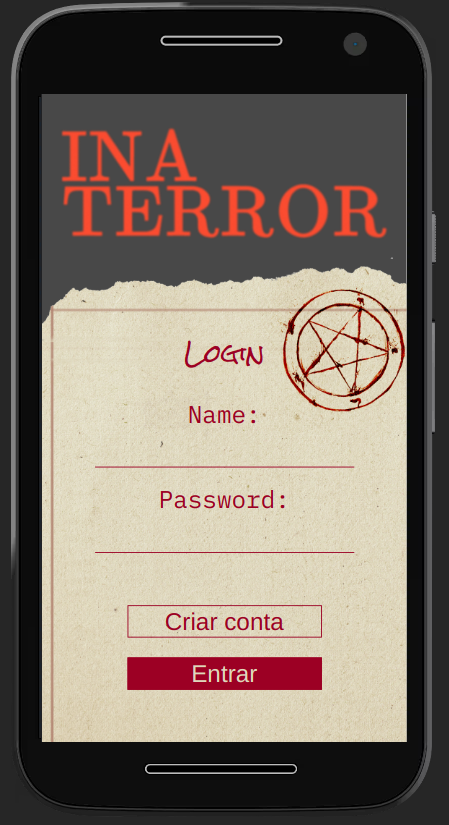
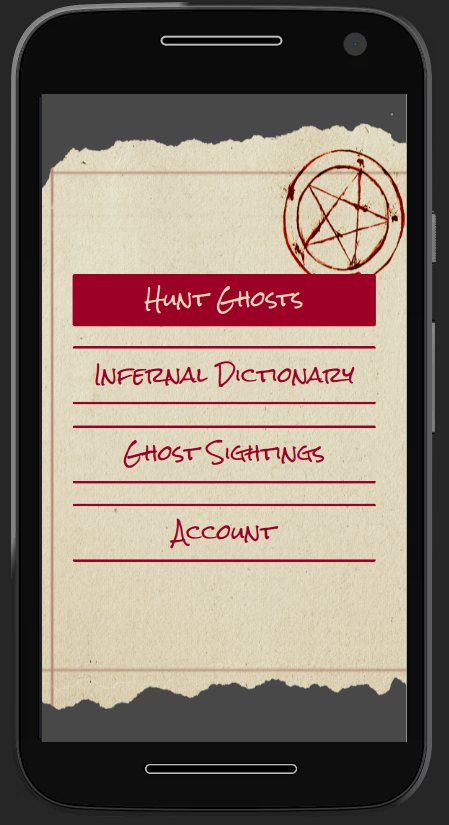
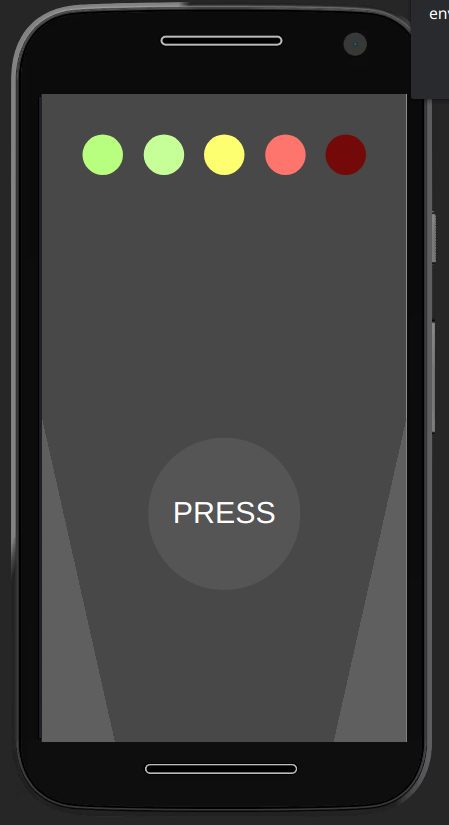

# InaTerror

## Project for database 2 :book:

This project is a ghost radar for a college subject.

## Technologies :rocket:

- ReactJS
- Python
- mongoDB
- PWA

## Getting Started 🏁

1. To run the APP you need to install **NodeJS**:
   https://nodejs.org/en/

2. After you cloned the git repository, you need to install dependencies with **npm**.

```bash
 #Write this on your terminal
 npm install
```

3. finally lets run the APP

```bash
 npm start
```

## User Interface 🎨


<p align="center">
   
   
   
</p>
